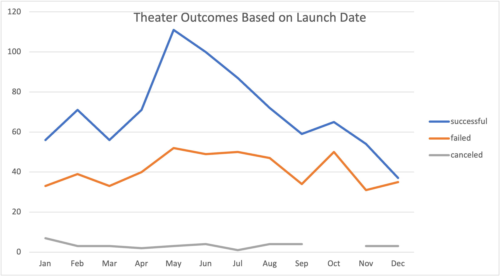
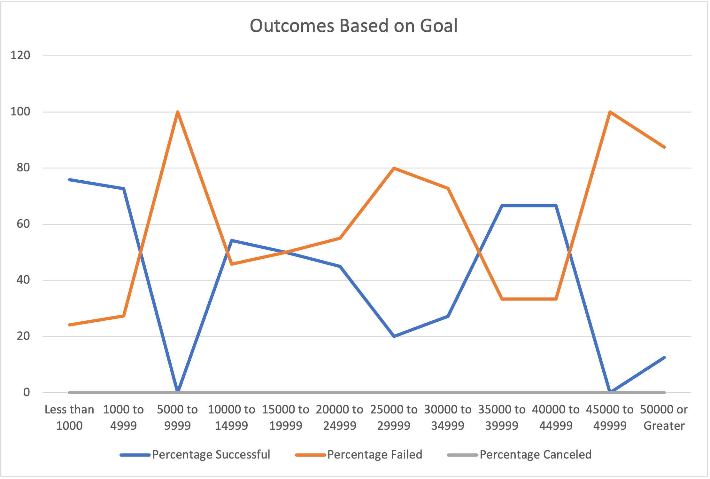

# kickstarter-analysis
Performing analysis on Kickstarter data to uncover trends 
## Overview of Project 
### Purpose of the Analysis
Per the request of my client, Louise, I've performed the following analyses to determine how various Kickstarter campaigns for theater projects fared in relation to their launch date and funding goals, and to uncover any potential trends to inform strategies for success for future theater-based Kickstarter campaigns that Louise may wish to launch. 
## Analysis and Challenges
### Analysis of Outcomes Based on Launch Date
In order to analyze the outcomes of theater-based Kickstarter campaigns based on their launch date, I created a pivot table of the Kickstarter dataset filtered by the parent category "theater." This provided a count of the number of successful, failed, and canceled theater campaigns organized by the month of their launch date. I've included a line graph generated from the pivot table below:

It should be noted that this graph includes all theater campaigns from the Kickstarter dataset, which covers multiple theater subcategories, campaign countries, and years of launch. 

### Analysis of Outcomes Based on Goals 
In order to analyze the outcomes of play-based Kickstarter campaigns based on their fundraising goal, I created a graph of the percentage of successful, failed and canceled Kickstarter campaigns for projects under the subcategory "plays," organized by fundraising goal ranges. The graph was generated off of a chart created to organize the Kickstarter dataset by fundraising goal range, outcome and subcategory using the `Countifs` Excel function. The graph is displayed below: 

It should be noted that unlike the Theater_Outcomes_vs_Launch graph, this graph includes only the subcateory "plays" from the parent category "theater." Further, while this graph displays the campaign outcomes based on the _percentage_ of campaigns which were successful, failed or canceled, the Theater_Outcomes_vs_Launch graph displays the raw _number_ of successful, failed and canceled campaigns rather than displaying them as a percentage. 

### Challenges and Difficulties Encountered
Potential challenges that could be encountered in working with this dataset include... 

## Results 
#### Conclusions Drawn from Outcomes Based on Launch Date 
Based on the 'Theater_Outcomes_vs_Launch' graph provided above, its apparent that May, June and July had the highest number of successful theater-based Kickstarter campaigns. Conversely, November, December and January/March had the lowest number of successful theater-based Kickstarter campaigns. This may indicate that the best time to launch a successful Kickstarter campaign for a theater project would be in the late spring or summer, with the worst time to lauch a successful campaign being in the late fall or winter.

Regardless of the launch date, its apparent that on a month-by-month basis there were always a greater number of successful Kickstarter campaigns for theater projects than failed campaigns, so Louise can feel optimistic about her odds of launching a successful kickstarter campaign for her next theater project. 

#### Conclusions Drawn from Outcomes Based on Goals
Based on the Outcomes_vs_Goals graph provided above, its apparent that there was a 100% failure rate for play-based Kickstarter campaigns with fundraising goals between $5,000 - $9,999 and between $45,000 - $49,000. We can also see that the highest success rates for play-based Kickstarter campaigns were those with goals of less than $1,000; followed by those with goals between $1,000 - $4,999; $35,000 - $39,999; and $40,000 - $44,999. 

The graph does not uncover any linear correlation between the success rate of play-based Kickstarter campaigns and the value of their fundraising goals, indicating that there may be other more influencial factors affecting the campaign success rate. However, it is worth noting that the vast majority of play-based Kickstarter campaigns (868 out of 954, or over 90%) had fundraising goals of less than $15,000, suggesting it may be most realistic to set a fundraising goal under the $15,000 range. 

#### Limitations of the Dataset
##### Limitation of "Outcomes Based on Launch Date" Data: 
The number successful/failed for each month does not account for the volume of campaigns month-to-month. It may be more informative to have a "percentage successful / percentage failed" based on total campaigns for each nonth. 

##### Limitations of "Outcomes Based on Goals" Data: 
* no division based on theater play SUBCATEGORY for launch date, but there was for goals. Also, launch date compared raw numbers while goals compared percentages. 

##### Other Limitations of the Dataset: 
* CURRENCY DIFFERENCES COUNTRY-to-COUNTRY NOT ACCOUNTED FOR 
*CAMPAIGN LENGTH NOT ACCOUNTED FOR (and according to Kickstarter website: "We recommend setting your campaign at 30 days or less. Campaigns with shorter durations have higher success rates, and create a helpful sense of urgency around your project."

#### Further Potential Analyses  
* PERCENTAGE of successful campaigns based on launch date 
